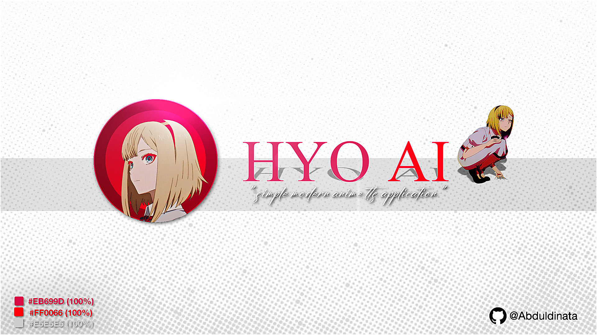
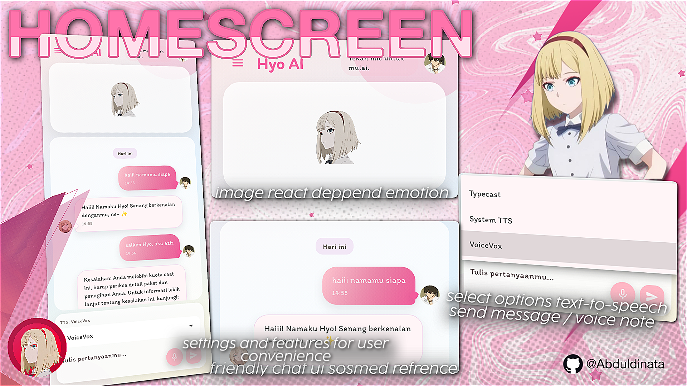
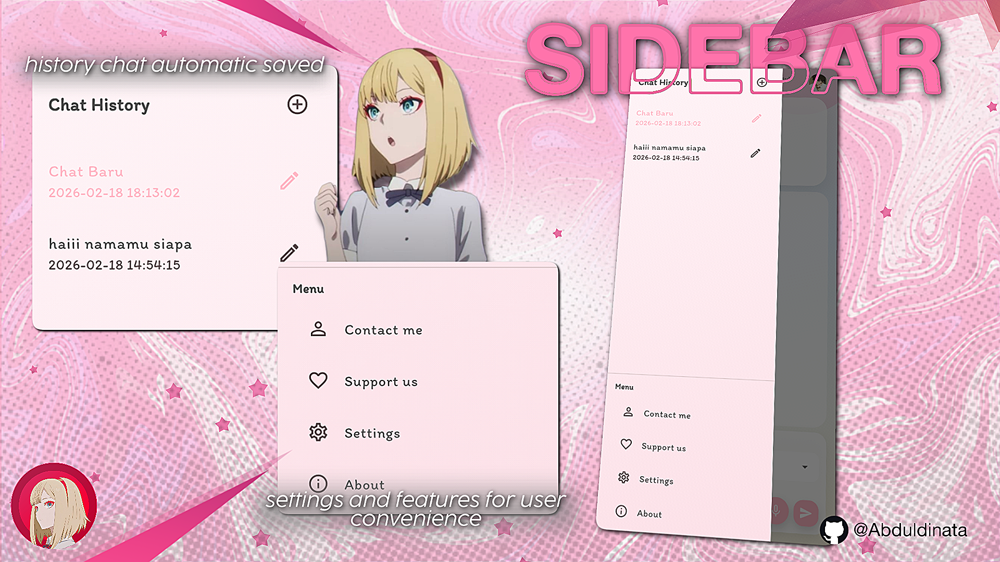
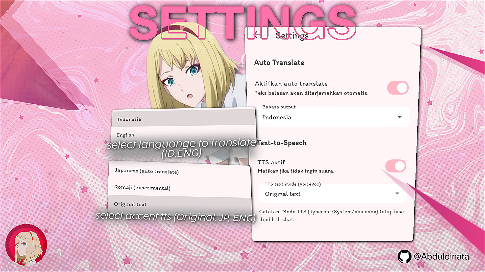

# hyo-ai-app
## Screenshots





Aplikasi asisten AI mobile bertema anime dengan fitur voice chat, TTS, dan UI pastel modern. Dikembangkan menggunakan Flutter dengan ide, konsep, dan desain utama dari saya, serta eksekusi dan pengembangan teknis secara kolaboratif menggunakan bantuan AI coding. Mendukung multi-bahasa, ekspresi karakter, dan integrasi VoiceVox & Typecast TTS. Cocok untuk showcase portofolio, eksplorasi UI/UX, dan demonstrasi kolaborasi manusia-AI dalam pengembangan aplikasi.

## Quick Start Commands


### Start Backend Trending API
Jalankan backend trending API (Node.js) dengan:
```sh
npm start
```
atau untuk mode development (auto-reload):
```sh
npm run dev
```

### Start VoiceVox Server
Jalankan VoiceVox Engine secara manual dan terpisah dari backend. Tidak ada auto-start dari backend/API. Ikuti petunjuk resmi VoiceVox atau gunakan script di folder `scripts/` jika tersedia.

## Getting Started

### Features
- 🌍 **Bilingual Support**: Auto-detects language (Indonesian & English)
- 🎤 **Voice Input**: Speech-to-text in both languages
- 🔊 **Multi-TTS Modes**: Typecast, System, VoiceVox, or Off
- 💬 **Smart Memory**: Remembers preferences and conversation context
- 🎨 **Anime Style**: Expression changes based on conversation
- ⏱️ **WhatsApp-style Timestamps**: Date separators and time display

### Prerequisites
- Flutter SDK 3.10.4+
- VoiceVox Engine (windows-cpu-0.25.1)
- Google Gemini API Key

### Setup
1. Copy `.env.example` ke `.env` (jika ada)
2. Set `GEMINI_API_KEY` dan `TTS_SERVER_URL` di `.env`
3. Jalankan VoiceVox Engine (manual atau via script di `scripts/`)
4. Run app: `flutter run`

## Development

### Available Commands
- `npm start` - Menjalankan backend trending API (Node.js)
- Jalankan VoiceVox Engine secara manual (atau gunakan script di `scripts/`)
- `flutter run` - Run Flutter app
- `flutter test` - Run tests
### Catatan
- Command `npm start` hanya untuk backend trending API, bukan untuk menjalankan aplikasi Flutter.
### TTS Modes
App mendukung 4 mode TTS (bisa ganti di dropdown):

1. **Typecast** (Recommended untuk Bahasa Indonesia)
   - Kualitas terbaik untuk bahasa Indonesia
   - Natural pronunciation
   - Butuh API key dan internet

2. **System TTS**
   - Menggunakan TTS bawaan device
   - Offline, tidak butuh setup
   - Kualitas tergantung device

3. **VoiceVox**
   - Self-hosted, gratis, voice anime Jepang
   - ⚠️ **Aksen Jepang untuk bahasa Indonesia** (wajar cadel/kurang natural)
   - Best untuk: bahasa Jepang atau mixed JP-ID
   - Setup: Run VoiceVox server di PC

4. **Off**
   - TTS dimatikan, hanya text response

**Rekomendasi**: Gunakan **Typecast** atau **System** untuk bahasa Indonesia pure. VoiceVox bagus untuk anime vibes tapi pronunciation Indonesia kurang sempurna karena enginenya dioptimalkan untuk Jepang.

### Language Support
App mendukung **bilingual auto-detection**:
- 🇮🇩 **Indonesian**: Ketik/bicara dalam bahasa Indonesia → AI jawab bahasa Indonesia
- 🇺🇸 **English**: Type/speak in English → AI replies in English
- 🔄 **Mixed**: Bisa ganti bahasa kapan saja dalam conversation

**How it works**: Gemini AI otomatis detect bahasa yang kamu pakai dan balas dengan bahasa yang sama. Tidak perlu setting tambahan!

**TTS Notes**:
- **Typecast**: Support both ID & EN (best quality)
- **System TTS**: Auto-detect language
- **VoiceVox**: Japanese accent for both (anime vibes 🎌)


### Project Structure
- `lib/` - Flutter source code
- `assets/` - Images, fonts, expressions, config
- `assets/config/` - File konfigurasi (prompts.json, context.json)
- `server/` - Backend server (server.js, dsb)
- `scripts/` - Helper scripts (VoiceVox starter, dsb)
- `.vscode/` - VSCode tasks configuration

### Security & Privacy
- File sensitif seperti `.env`, QR code, dan credential lain sudah diamankan dan tidak ikut ke repo (lihat `.gitignore`).
- Contoh konfigurasi tersedia di `.env.example`.

### UI & Fitur Terbaru
- Palet warna pastel (Sakura Pink, Lavender, Soft Blush), font Itim, efek glassmorphism, GlowBlobs, dan UI extra rounded.
- Konsistensi desain di semua halaman (profile, about, contact, support).
- Struktur project lebih rapi dan maintainable.

### Release APK
Untuk versi rilis APK, silakan download melalui halaman [GitHub Releases](https://github.com/Abduldinata/hyo-ai-app/releases). Setiap versi APK diupload secara profesional melalui fitur Releases, bukan di dalam source code repo.

### Changelog
Lihat riwayat perubahan lengkap di [CHANGELOG.md](CHANGELOG.md).

### License
MIT License © 2026 Abdul Aziz Dinata
